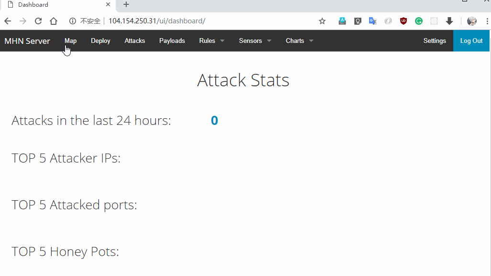

# Week 9 Project: Honeypot

Time spent: 40 hours spent in total

### Project summary 

In this project we stand up a basic honeypot and demonstarte its effectiveans at detecting and collecting data about an attack. The project requires to use a well-supported open source honeypot, which is Modern Honey Network(MHN). MHN is a centralized server for management and data collection of honeypots.

### Exporting Data

Attempted to export session file 

mongoexport --db mnemosyne --collection session > session.json
-bash: session.json: Permission denied
